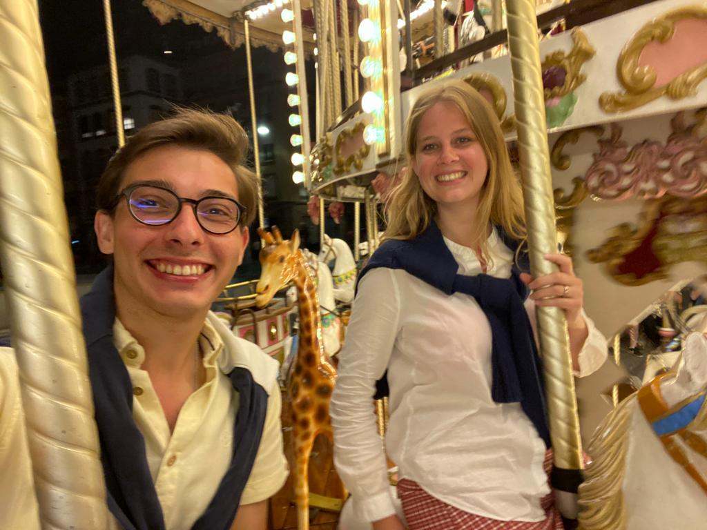
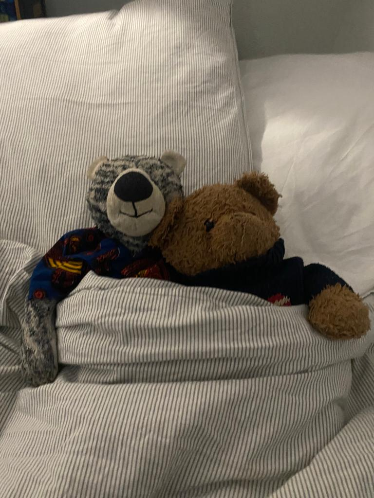

# The 22071997 reasons I like you so much

## Here you have a reminder why you are such an incredible person!

### So, los geht's!

#### **1 - Just yourself**
This one is tough to explain. Being Caro is just something impossible to not like.

#### **2 - Honesty**
You're a source of honesty. When something is going on, you always tell me what's up!

#### **3 - Ladybug**
Besides not having wings and not being red (well, in summer that is discussable), you can still make me smile with both heart and face as a tiny and cute ladybug!

#### **4 - Blue Ocean Eyes**
We are not living close to the sea and that makes me feel really far away from home. Even though, your eyes penetrate in my heart and bring the blue and deep ocean to my daily life. You make me feel home! 

#### **5 - Teddy Master**
I think this one does not need any explanation. Taking care of Teddy, Malaquias and even sometimes Vasquinho is not an easy task, but you rock it!

#### **6 - Lasagne**
The best lasagne I have ever had in my life. It was not only the bechamel that melted. Also my heart!

#### **7 - Emily in Paris**
Usually, I don't like those kind of series. In fact, I don't like series that much. But I love to watch it with you!

#### **8 - Paulaner Spezi**
If it was not you, how would I find about this magic mix?

#### **9 - Kebap**
Just date a girl that asks you to go to kebap places.

#### **10 - 1.0 Sehr Gut**
No need.

#### **11 - Traveller**
Going for the world, enjoying what it has to give to us!

#### **12 - Easter, Birthday and Christmas together**
You're better than that, of course.

#### **13 - Ice, Eis or Ice-cream?**
Well, what you call it does not matter; what matters is that we are the Balla Beni best clients!

#### **14 - Tennis**
Who else makes me play tennis at 8 in the morning?

#### **15 - Schokocroissant für uns!**
This one is easy!

#### **16 - Briefe von Felix**
The one and only that has the patience to listen to my german language practice sessions

#### **17 - Notarzt specialist**
1200€ is quite a lot, rigth?

#### **18 - Creme Brûlée**
Because a perfect lasagna can't come alone

#### **19 - The Swing Girl**
How to prepare better for kids than going with you to the swing?
 
#### **20 - Massages**
Who else could help me improve my massages?

#### **21 - Early Bird**
Better than waking up early, is having your perfect eyes and smile next to me when waking up

#### _DO YOU WANT TO BE MY GIRLFRIEND?... 

#### **She said yes!!!**

#### **Merry Christma, Ladybug!**

<!--- List

1. Numbered
2. List

**Bold** and _Italic_ and `Code` text

[Link](url) and 

For more details see [Basic writing and formatting syntax](https://docs.github.com/en/github/writing-on-github/getting-started-with-writing-and-formatting-on-github/basic-writing-and-formatting-syntax).-->

